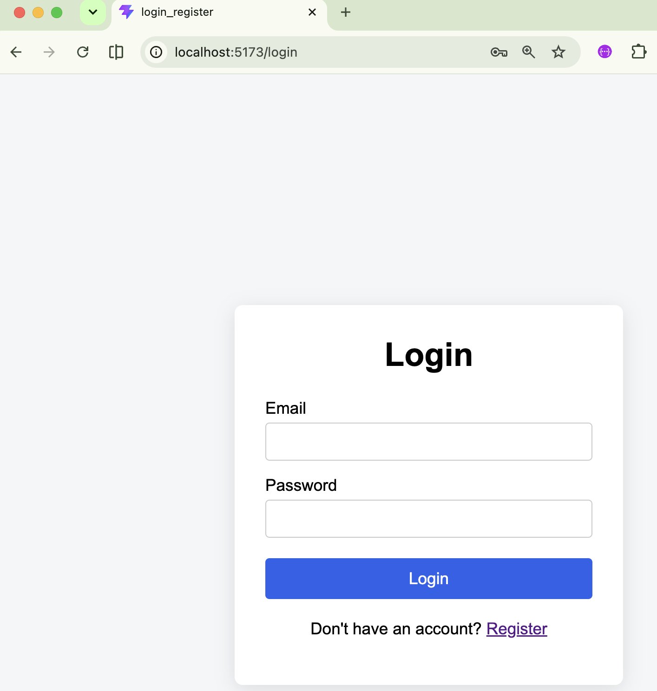
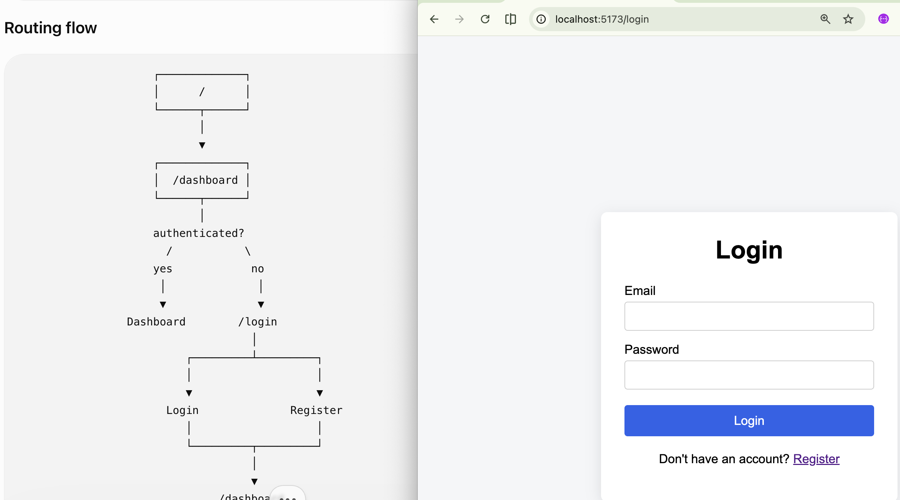
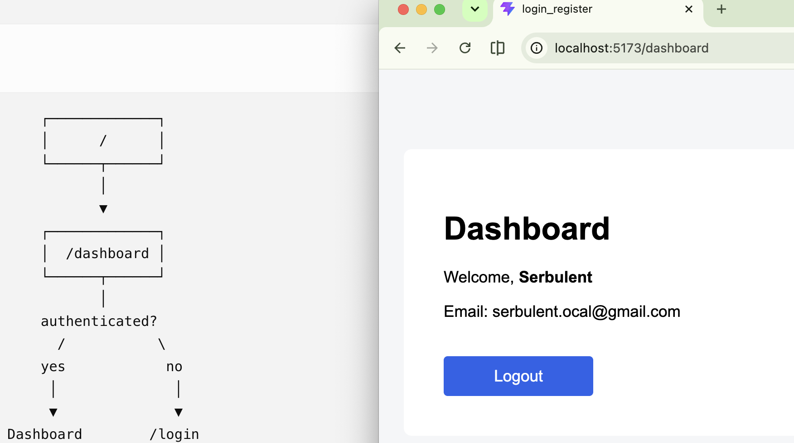
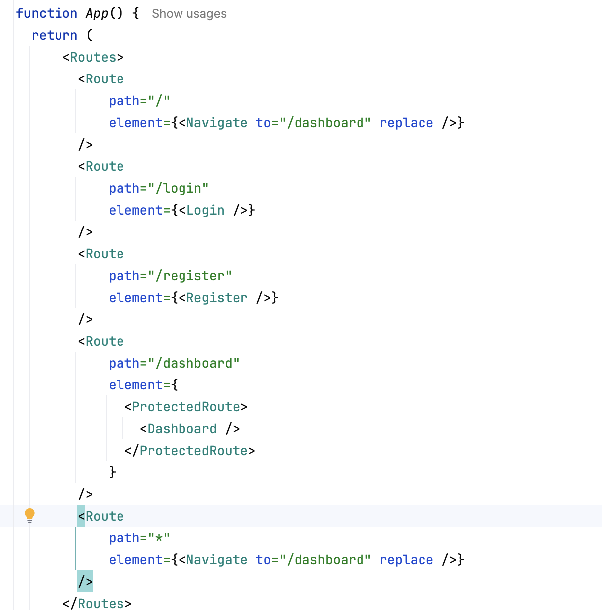
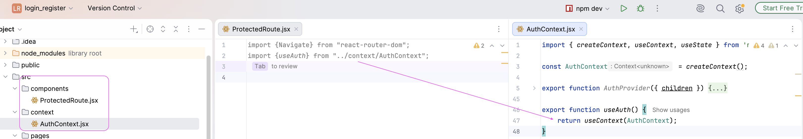
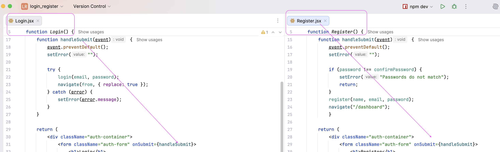

# esirgeyen ve bağışlayan ❤️ Allah'ın (c.c) adıyla - 2springboot_and_12react

## client-side-only authentication with React + Vite 

it is composed of;
* /login
* /register
* /dashboard
 
* React Router
* Protected dashboard route
* Login/register forms
* localStorage authentication
* Logout
* Redirects between authenticated/unauthenticated areas
 

## project_folder_structure
* components/: Stores reusable UI components like buttons, inputs, and navbars.
* context/: Stores context providers like authentication context.
 

* pages/: Stores pages like login, register, and dashboard.

  

